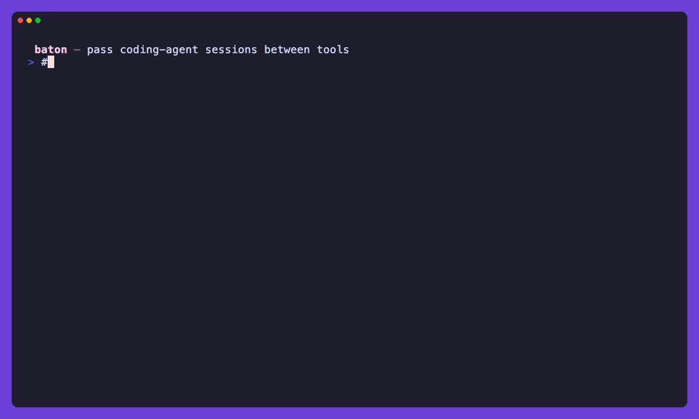

<div align="center">


**Pass the baton between coding agents.**

Convert any coding-agent session to any other. One command. Keep going where you left off.

[](https://crates.io/crates/baton-mcp)
[](https://www.npmjs.com/package/@kasabeh/baton-mcp)
[](https://github.com/Kaseban/baton/actions/workflows/ci.yml)
[](#supported-formats)
[](#license)



A passed transcript kept **14/17** concrete facts. A hand-written handoff summary kept **3/17**. [Benchmark ↓](#benchmark)

</div>

---

## The 4 p.m. problem

It's 4 p.m. Claude Code says **"usage limit reached — resets at 10 p.m."** You're three hours into a session: architecture decided, edge cases mapped, half the diff written.

❌ **Without baton** — open another agent and start from zero. Re-explain the plan. Re-read the files. Re-litigate every decision you already made.

✅ **With baton** — pass the session and keep going:

```sh
baton convert --from claude-code --to opencode --latest --import
# using latest claude-code session: 2026-07-09 15:58  Refactor the auth middleware to…
# passed baton: claude-code → opencode (1388 messages) → handoff.json
# Imported session: ses_8c4c973a521549e2

opencode -s ses_8c4c973a521549e2   # same conversation, different runner
```

Works in every direction: switch agents mid-task, try a second opinion on a hard bug, move a session from your editor agent to a terminal agent, or archive everything in one format.

## Quick start

```sh
# zero-install run (downloads prebuilt binary)
npx @kasabeh/baton-mcp --help

# convert your most recent session + auto-import into the target agent
baton convert --from claude-code --to opencode --latest --import

# or omit the path to pick interactively — newest first,
# each session previewed by its first user message
baton convert --from claude-code --to opencode --import

# or pass an explicit session file
baton convert --from claude-code --to opencode <session.jsonl> --import

# see every session on your machine, across all agents
baton list
```

### Where do session files live?

You never have to hunt these down (`--latest` and the interactive picker find them for you), but for reference — each agent stores its transcripts on disk:

| Agent | Location |
|---|---|
| Claude Code | `~/.claude/projects/<encoded-cwd>/<session-uuid>.jsonl` |
| Codex CLI | `~/.codex/sessions/<YYYY>/<MM>/<DD>/rollout-*.jsonl` |

`baton list` prints the path of every session it can find, across all agents.

## Supported formats

| Agent | Read | Write | Auto-import |
|---|:---:|:---:|:---:|
| Claude Code | ✅ | ✅ | — |
| OpenCode | ✅ | ✅ | ✅ `opencode import` |
| Codex CLI | ✅ | ✅ | — |
| Gemini CLI | ✅ | ✅ | — |
| Zed | ✅ | ✅ | — |
| Aider | ✅ | ✅ | — |
| Cursor | ✅¹ | —² | — |
| Continue | ✅ | — | — |
| Cline / Roo | ✅ | —² | — |

¹ Cursor reads from exported JSON (`sqlite3 state.vscdb "SELECT value FROM ItemTable WHERE key='aiService:chats'"`)

² Not planned: Cursor and Cline keep session state inside editor databases (SQLite / VS Code globalState) with no file-level import path.

## Benchmark

Does carrying the full transcript beat writing a handoff summary for the next agent? We measured both on a real 3.4 MB Claude Code session (same model both arms, only the context differs):

| session size | baton transcript | handoff summary |
|---|---:|---:|
| sm (93 KB) | **3/3** details recalled | 1/3 |
| md (198 KB) | **6/6** | 1/6 |
| lg (599 KB) | **5/8** | 1/8 |
| **total** | **14/17** | **3/17** |

The summary lost concrete facts (versions, line counts, MSRV) even on the smallest slice — the receiving agent had to re-read files and re-run commands to rediscover them. Mechanical fidelity: all 896 messages are written to every target; round-trip loss reflects each target format's expressiveness (claude-code 896/896, codex 736, gemini-cli 723, aider 111 — it stores chat text only).

We also measured **task continuation**: cut the session at three mid-task points, ask a fresh agent to state the task, state, and next steps. Result: parity (baton 10/12, handoff 10/12) — a good summary is enough for *what to do next*; the transcript is what answers the *specific factual questions* the summary's author didn't anticipate. And the summary only exists if an agent spends a full transcript read writing it — baton makes the transfer free.

Full methodology, caveats, and reproduction steps: [benchmark/RESULTS.md](benchmark/RESULTS.md).

## MCP server

baton is also an MCP server — your agent can pass the baton itself, mid-conversation:

| Tool | Description |
|---|---|
| `list_sessions` | Scan all agents, return a unified list |
| `convert_session` | Convert a session from one format to another |
| `import_to_target` | Convert + run the target agent's import command |
| `detect_format` | Sniff a file/dir and report which agent produced it |

```sh
baton install     # registers baton in every detected agent's MCP config
baton doctor      # verify
baton uninstall   # remove from all agents
```

## How it works

```
Claude Code session (.jsonl)
      │
      ▼
  baton read ──► canonical Session { messages: [Text, Reasoning, ToolCall, ToolResult] }
      │
      ▼
  baton write ──► OpenCode import JSON (SessionV1 schema)
```

Every agent format is read into a **canonical intermediate representation**, then written out in the target format. Adding a new format is O(1), not O(N×M) per-pair converters.

## Install

```sh
# npm (prebuilt binary, no Rust needed)
npm install -g @kasabeh/baton-mcp

# Homebrew
brew install kaseban/tap/baton-mcp

# Cargo binstall (prebuilt binary)
cargo binstall baton-mcp

# Cargo (from source)
cargo install baton-mcp

# Shell installer (prebuilt binary)
curl --proto '=https' --tlsv1.2 -LsSf https://github.com/Kaseban/baton/releases/latest/download/baton-mcp-installer.sh | sh
```

Or grab a binary from [GitHub Releases](https://github.com/Kaseban/baton/releases).

## Building

```sh
git clone https://github.com/Kaseban/baton.git
cd baton
cargo build --release
./target/release/baton --help
```

## Contributing

Each format lives in `src/formats/<name>.rs` and implements the `Format` trait (read + write). See `src/formats/claude_code.rs` for a complete reference implementation.

All nine formats have readers; Claude Code, OpenCode, Codex, Zed, Aider, and Gemini CLI also have writers. The most impactful contribution now is a **writer** for Continue.

### Regenerating the demo

The README GIF is scripted with [VHS](https://github.com/charmbracelet/vhs): `vhs assets/demo.tape`. It records against a sandboxed `$HOME` (`/tmp/demo`) populated with fabricated sessions, so no real session data ends up in the GIF.

Don't drop the baton.

## License

Dual-licensed under MIT OR Apache-2.0.
